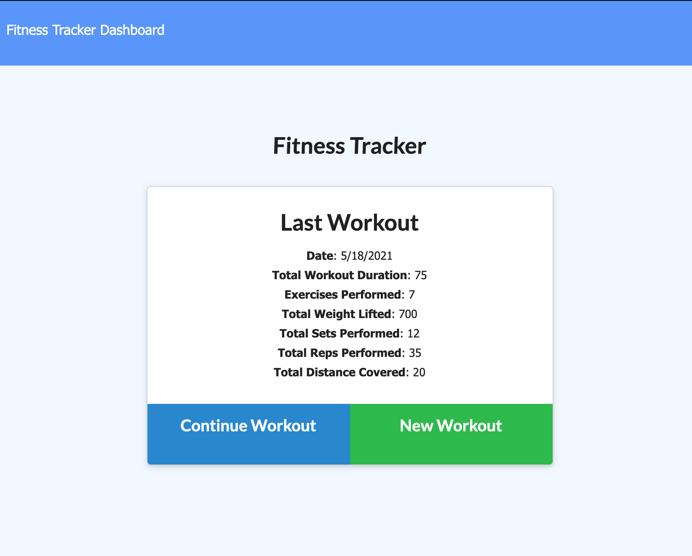
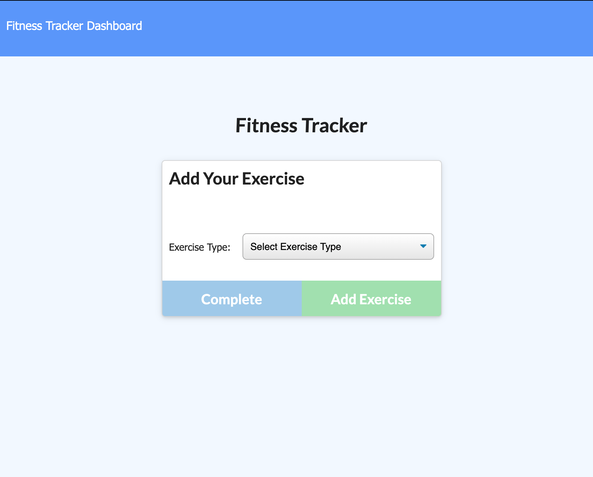
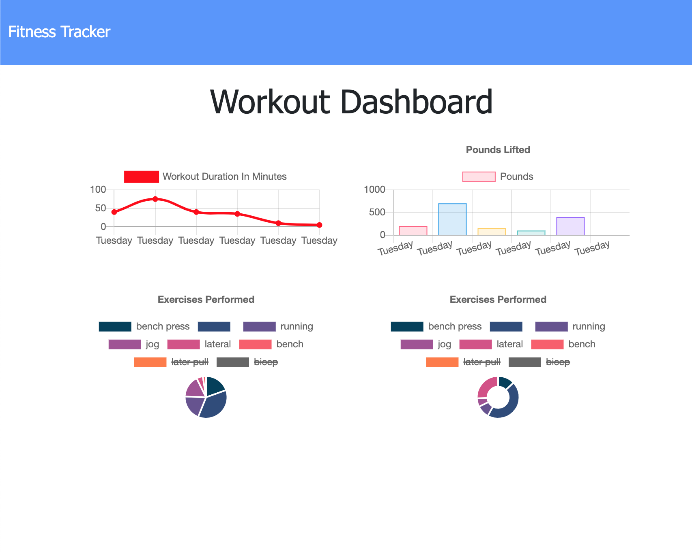

# FitnessTracker

## Description

This application is used to view create and track daily workouts with ease.

## Licensing

## Technologies Used

* Express
* NoSql - MongoDB
* Mongoose

## Usage

When the user loads the page, they will be given the option to create a new workout or continue with their last workout.

The user then is able to:

  * Add exercises to the most recent workout plan.

  * Add new exercises to a new workout plan.

## Demo

Deployed Heroku application: https://guarded-headland-88940.herokuapp.com/
## Screenshots

## Questions
* My repositories can be found at https://www.github.com/seppalaerin
* For any questions regarding this application, you can email me at SeppalaErin98@gmail.com
